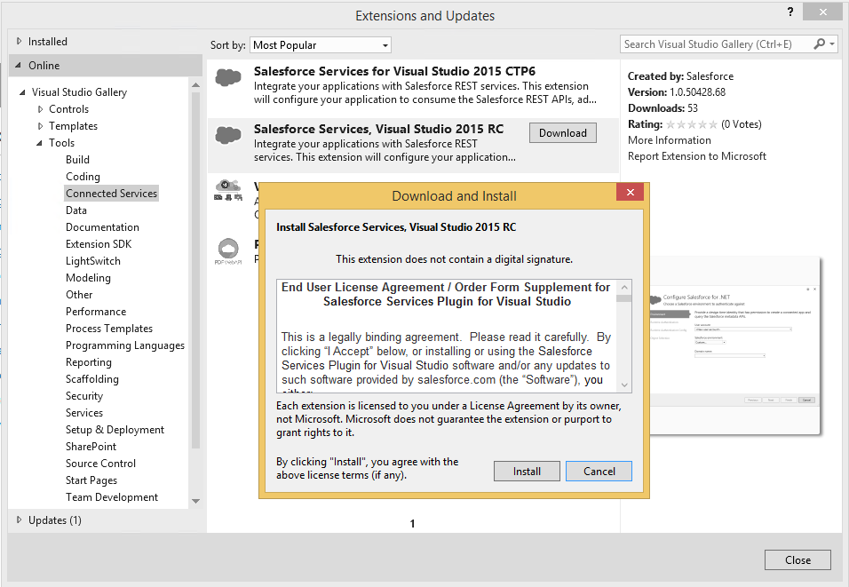
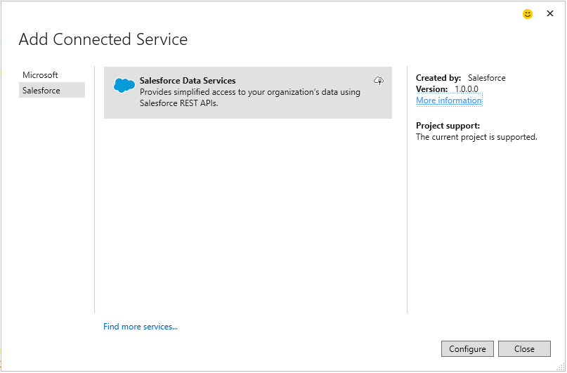
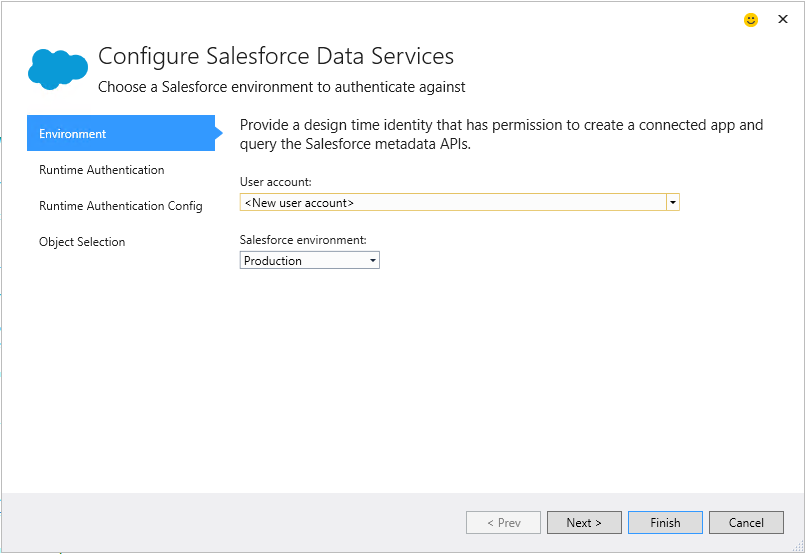
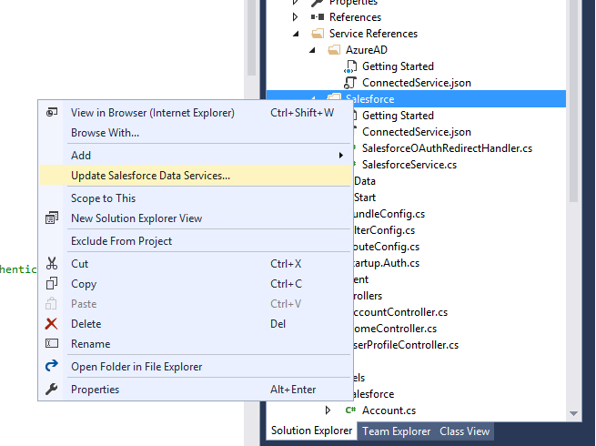

# Salesforce Connected Service Exploratory Test Guide

This document is a testing guide for contributors to the Salesforce Connected Service components. It is meant as a testing aid in our joint effort to deliver high-quality experiences to end-user developers. Rather than a set of scripts to be strictly followed this document is meant as a checklist of areas to test. It is organized by scenarios so that contributors can understand the potential impact of their changes both in development and testing of their contributions. The checklist is based on the experiences in using the [Exploratory Testing](http://en.wikipedia.org/wiki/Exploratory_testing) methodology in testing the original contribution.

## Installation

- Appropriate EULA is shown on installation from the Extensions and Updates Gallery.‚
- The correct supported version(s) of Visual Studio is indicated.‚

## Service Selection

- Version corresponds the assembly version of Salesforce.VisualStudio.Services.dll.
- Project type support
  - The Configure button is disabled for all unsupported project types.
  - Supported projects work for all scenarios else scenario is blocked.

## Configure

### User Experience and User Interface

- Tab sequence/Keyboard navigation follows the logical flow of controls and configuration sequence.
- Screen reader behavior - turn on Windows Narrator and validate that controls and labels are narrated.
- Visual Studio Theming compatibility (Dark, Blue, Light).
- Appropriate validation is in place for each wizard control - validation adorner, page validation, navigation block is blocked as appropriate.
- Appropriate Most-recently-used list/dropdown controls (MRUs) are in functional.
- UI not blocked by background logic.  Data is loaded in a background thread before the user needs it.
- Any exceptions are handled appropriately for the scenario. Unexpected exceptions should be logged in the VS output window and should not crash the wizard or Visual Studio.
- Guidance links go to appropriate web content.
- Resizing the dialog produces gd control flow.
- Wizard navigation behaviours
  - Jumping back and forth should retained entered information.
  - Click 'Finish' directly from the first page.

- Object Selection
  - Type ahead brings focus to the appropriate object.
  - Objects are sorted. In update mode, the pre-selected objects are alphabetically sorted at the top, then the unselected objects.
  - Tri-State on 'all objects' node works (checked, unchecked, sub-item checked).

### Handler

- Handles existing configured items - Connected App, web.config settings, scaffolded code/service folder.
- References and Nuget packages are added to specific project types and project flavours needs (eg. Web projects differ from console projects).
- Adding references and Nuget packages takes into account users could have removed and added references and packages to the existing project.
  - Are references and Nuget package dependencies checked for explicitly?

- Appropriate project compatibility is declared (this is used in the Service Selection project type support section).
- The progress indication bar should animate relatively smoothly. Minimize halting of the animation by performing long-running processing asynchronously. 
- Supports multiple Salesforce instances per project.
- Performance - any lengthy process (e.g. service calls) do not block the UI thread and the UI remains responsive.
- Exceptions are handled appropriately.  Exceptions should not necessarily cause the handler to fail, in some cases reporting these as errors/warnings in the progress dialog and continuing on may provide the best end-user experience.
- Validate correct behaviour of source code and configuration files under source control.

### Code Scaffolding

- Code compiles in all runtime authentication configurations, with the exception of the #error line placed in the Service Account, Username/password strategy.
- End-user template customization are supported
  - Template changes are preserved in the user directory, while the vsix directory are replaced with the updated templates.
  - If custom templates are deleted the original templates laid down by the vsix are used in scafolding. 
  - Template changes in the extension folder are ignored when scaffolding.

- Object code is scaffolded in the Models\[SalesforceInstance] folder.
- Objects are annotated consistently with Describe metadata from Salesforce.

### User Settings (ConnectedServices.json)

- Persisted upon wizard completion.
- Values are read when the wizard begins.
- Values are defaulted when the wizard begins, and the values don't exist in the ConnectedServices.json file.

### Design Time Authentication

- MRUs maintain a list of recently entered items.
- My Domain is validated a well-formed url.
- After the user is prompted for the Salesforce credentials the Refresh Token cached.
- Data re-read upon credential change (e.g. Objects - object selection is refreshed so to reflect the permissions of the new user) .
- Salesforce sign-in can be cancelled.
- Salesforce app authorization can be cancelled.
- When accessing Salesforce with an expired refresh token the Salesforce credentials dialog is shown so users can obtain a new refresh token.
- All three Salesforce Environments are validated (Production, Sandbox, Custom).

### Runtime Authentication

- If a custom domain was entered, the value appears in the combobox. If the developer checks the checkbox, the value entered in the designtime auth is selected.

### Getting Started Document

- Content including guidance, description, and code snippets reflect the change that are being made. When new versions are created, previous versions of the documents must be maintained to support users with different versions of the connected services extension. 
- Walk through the getting started document, paste the sample code, make the namespace, etc.

## Update Salesforce Data Services

- ConnectedServices.json 
  - Extended Data and its properties are not written if they are not used.
  - Extended Data is not required.  Logic that reads the data will default as appropriate if missing.  Consider Extended Data as a hint.
  - Extended Data values are validated and error cases are handled appropriately.  File can be edited by the end user.
  - Extended Data does not contain values that can be retrieved via other means (e.g. config, code, project settings) As a general Connected Services Principle, we model over the developers code, with possible hints placed in the .json file.

- Object Picker and authentication wizard pages correctly reflect the current configuration.
- Appropriate defaulting logic is run if configuration cannot be detected.
- Previously scaffolded objects are selected, alphabetically sorted, disabled, and placed at the top of the list.
- Runtime authentication settings are correct and disabled appropriately.

## End-to-End App Testing

- User code scaffolded has appropriate xml documentation.
- End-user scaffolded code is verified in a running app.
- Code compiles in all supported project flavors and for all runtime authentication configurations. (Not all projects have the same assembly references out of the box).
- Field validation behaviour is correct based on scaffolded Describe annotations.

### Runtime Authentication configurations end-to-end walkthroughs

- Web Server Flow 
  - All scaffolded code paths are accessible using a refresh token.
  - Branded sign in page is accessible.

- User name password in service account app scenarios (eg. Console app, Web job) allow access to objects and protected resources.

- User permissions allow access to objects and object queries and conversely lack of permissions blocks access to objects and queries.